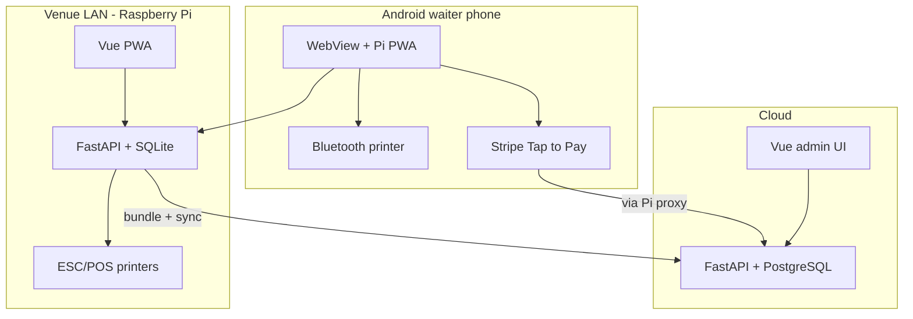

# Vendiqo Order Platform

Vendiqo is a multi-tenant event and venue POS system. **Verleiher** (hire companies) rent POS hardware to event customers: the **cloud** stack configures organisations and events; **Raspberry Pi** edge servers run on-venue ordering, printing, and sync; the **Android** app wraps the Pi PWA for waiter devices with Bluetooth printing and Stripe Tap to Pay.



## Features

### Cloud admin

- Multi-tenant **Verleiher** model with role-based access (`platform_admin`, `tenant_admin`, `organisation_admin`, `member`)
- Organisations, events (config → test → prod → archive), catalog (articles, categories, ingredients), waiters
- Appliances (server, printer, mobile, tablet, router, ap), lendings, and Pi pairing codes
- User management, tax codes, countries, payment types
- Event configuration: stations, printers, layouts, vouchers, kitchen monitors, cash registers, receipt printing
- Sales reports, event stats, transactions, cash sessions, bookkeeping export, collective bill PDFs
- Stripe Connect onboarding and Stripe Terminal edge API (optional in local dev)
- Hosted Cloud-Pi browser sandboxes for events in config status
- Orderjutsu import wizard
- Help center and admin UI in German and English; locale-aware money and date formatting

### Pi edge

- Offline-first ordering with SQLite and background cloud sync
- Waiter ordering, open tables, split-pay, collective bills (Sammelrechnung)
- Cash registers, customer display, shift sessions
- Kitchen monitor, pickup screen
- Payments: cash, TWINT, SumUp; card via Stripe Terminal on Android
- Vouchers, stock tracking, receipt history
- ESC/POS network printing (python-escpos)

### Android (Vendiqo Waiter)

- Native WebView wrapper for the Pi PWA
- Bluetooth ESC/POS receipt printing
- Stripe Tap to Pay via `window.AndroidTerminal`

## Monorepo layout

| Path | Purpose |
|------|---------|
| [`cloud/`](cloud/) | Cloud backend (FastAPI + PostgreSQL) and admin frontend (Vue 3 / Vite / TypeScript) |
| [`pi/`](pi/) | Pi edge backend (FastAPI + SQLite) and venue PWA (Vue 3 / Vite) |
| [`android/`](android/) | Vendiqo Waiter Android app |
| [`packages/vendiqo_shared/`](packages/vendiqo_shared/) | Shared Python helpers (VAT split, stock, bundle contract) |
| [`packages/frontend-shared/`](packages/frontend-shared/) | Shared frontend utilities |
| [`website/`](website/) | Static landing page and privacy policy (production via Caddy) |
| [`sd-card-creator/`](sd-card-creator/) | Raspberry Pi OS SD card image build tooling |
| [`docs/`](docs/) | Integration guides (e.g. [Stripe Connect / Terminal](docs/stripe-connect-terminal.md)) |

Further documentation: [cloud/README.md](cloud/README.md), [pi/README.md](pi/README.md), [android/README.md](android/README.md), [sd-card-creator/README.md](sd-card-creator/README.md), [AGENTS.md](AGENTS.md).

## Quick start

Use two terminals (or run stacks sequentially):

**Cloud:**

```bash
cd cloud
cp .env.example .env
docker compose up --build
```

- API: `http://localhost:8000` (health: `/health`)
- Admin UI: `http://localhost:5173`

**Pi edge** (with cloud running):

```bash
cd pi
cp .env.example .env
docker compose up --build
```

- API: `http://localhost:8001`
- PWA: `http://localhost:5174`

Set `SYNC_ENABLED=0` in `pi/.env` to run the Pi without cloud pairing.

**Android** (debug/emulator): loads Pi frontend from `http://localhost:5174` (`adb reverse tcp:5174 tcp:5174`); API `http://localhost:8001`. See [android/README.md](android/README.md).

Default cloud admin login (from `cloud/.env.example`): `admin@vendiqo.local` / `admin123`.

## Tests

Backend (pytest):

```bash
cd cloud/backend && uv sync && uv run python -m pytest tests/ -v
cd pi/backend && uv sync && uv run python -m pytest tests/ -v
```

Requires [uv](https://docs.astral.sh/uv/) (`curl -LsSf https://astral.sh/uv/install.sh | sh`).

Frontend (Vitest):

```bash
cd cloud/frontend && ../../scripts/npm.sh ci && npm test
cd pi/frontend && ../../scripts/npm.sh ci && npm test
```

See [AGENTS.md](AGENTS.md) for coverage commands and CI details.

## Conventions

- Cloud backend uses PostgreSQL; Pi backend uses SQLite on the device.
- Router DB writes use `commit_or_raise()` (see `cloud/backend/app/db_errors.py`).
- FastAPI routes with synchronous SQLAlchemy session access are `def` (not `async def`) to avoid blocking the event loop.
- Shared Python logic (e.g. VAT split) lives in `packages/vendiqo_shared` and is re-exported by cloud/pi.
- Production startup requires successful Alembic migrations; there is no silent `create_all` fallback.
- Local dev frontends run as Vite dev servers inside Docker.

## Lockfiles

Python dependencies are managed with [uv](https://docs.astral.sh/uv/): each backend (`cloud/backend`, `pi/backend`, `cloud/hosted-pi-manager`) has a `pyproject.toml` plus a committed `uv.lock`. Update dependencies with `uv add <pkg>` / `uv lock` and commit both files together; Docker and CI install with `uv sync --frozen`.
